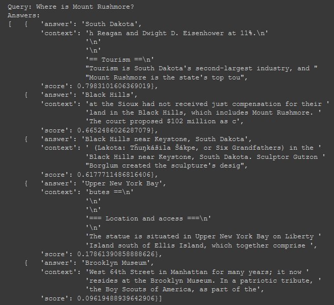
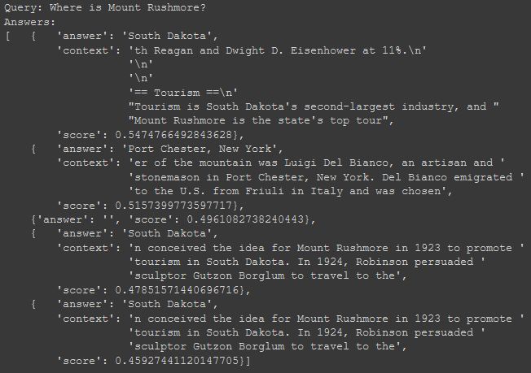
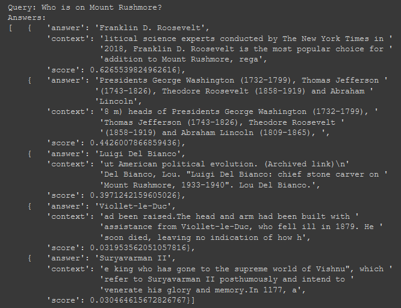
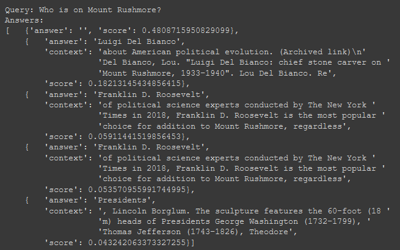

# CS 301 Project Report

# Long-form Q&A Search System, Aaron Lee

# Abstract

The problem for this project is to create a long-form Question-and-Answer (Q&A) system. This problem means that a user is able to give the system a question (in natural language) and be returned an answer or a set of answers for their question. The answer will be obtained by “reading” a number of documents that relate to the question. These documents should be filtered so that they are a small and manageable subset of the overall documents stored. For example, if a user asks the system, “What color is the sky?”, then the system should answer “blue”. 

In some variants of this problem, if a question is not able to be answered from any of the documents stored, the user will be notified that there is no answer. This problem is more difficult than it may seem because the system also has to be able to tell if a closely-worded answer does not give the actual answer. For example, if a user asks the system, “Who is the first person to land on one of Jupiter’s moons?”, then the system should answer “no answer” because it is not possible to tell. While answering this question, the system should also ignore closely related “answers” such as “who is the first person to land on the Moon?”. 

This problem will be approached by using the Haystack API, an open-source and state-of-the-art framework for searching a large collection of documents. The Haystack API includes many useful features, such as how to store documents along with a Reader node. These features will all aid in constructing the pipeline. 

While development of Long-form Q&A Search Systems is still ongoing, the current state is still capable of complex tasks. 

# Introduction

The problem for this project is to create a long-form Q&A system. At a minimum, this problem involves interpreting a user-given question (in natural language) so that it can be “understood” by the pipeline, and then use this interpretation to find an adequate answer. This answer will be based on the information available, meaning the documents given to it. For this project, the information available consists of either wikipedia articles, all in natural language.

Long-form Q&A Search Systems are important because they allow people to learn new information more easily. It is easier for people to ask questions in natural language than having to manually set filters before searching. It is more time-intensive to have to read an entire textbook just to get an answer to a simple question. The Q&A system would help immensely for these cases. 

# Related Work

Long-form Q&A systems are currently actively being worked on by several companies. One company that has been developing one is Facebook. Facebook’s implementation and Haystack’s are both very similar. Because Facebook’s implementation is available to the public, their implementation is also available as an option to be used in Haystack’s API. They are both being developed with the goal of being able to process extractive and abstract answers. An extractive answer is one in which the answer can be found word-for-word within the stored documents. An abstract answer is one in which the system creates more natural sounding answers that take parts of information from several documents. 

# Data

Initially, I wanted to use a popular question-answering dataset, Stanford Question Answering Dataset (SQuAD), but this dataset was too difficult to work with. The dataset consists of over 100,000 question-answer pairs that were based on over 500 different wikipedia articles. It took a large amount of time just to view the dataset, let alone do any preprocessing.

I ended up using a manually-selected collection of wikipedia articles instead. I picked the general topic of “Buildings, structures, and statues” arbitrarily, then selected the 30 most viewed articles related to this topic. The exact list of article titles used are as follows:
* Taj Mahal
* Statue of Liberty
* Burj Khalifa
* Great Wall of China
* Eiffel Tower
* Berlin Wall
* Machu Picchu
* Stonehenge
* Mount Rushmore National Memorial
* Colosseum
* Great Pyramid of Giza
* One World Trade Center
* Empire State Building
* White House
* Petra
* Large Hadron Collider
* Hagia Sophia
* Golden Gate Bridge
* Panama Canal
* Angkor Wat
* Buckingham Palace
* Big Ben
* Guantanamo Bay detention camp
* Christ the Redeemer (statue)
* Pantheon, Rome
* Parthenon
* Disneyland
* Colossus of Rhodes
* New York Stock Exchange
* Wembley Stadium 

The articles were downloaded using the Wikipedia Python module. These articles are all in natural language. While the number of articles is much smaller than the originally planned SQuAD dataset, I believe it is sufficient to demonstrate some of the API’s capabilities. 

# Methods

Before performing any actual processing, I first downloaded the wikipedia articles and stored them in a DocumentStore. A DocumentStore can be thought of as a database that stores documents along with any of their metadata. On request, the DocumentStore should be able to provide any of this information to the Retriever node. There are different types of DocumentStores that each have their own benefits and costs. The DocumentStore I used was ElasticSearch, which is fast and accurate for sparse document retrieval. Other types of DocumentStores that were considered include FAISS and Milvus. While these DocumentStores can quickly and accurately handle dense documents, they are not capable of sparse documents, which this project focuses on.

The Haystack API works by constructing pipelines out of several different components. Some examples of these components are the Retriever node, the Reader node, the Generator node, and the Summarizer node. These nodes each serve different functions, may take different inputs, and produce different outputs. For example, the Generator node takes a natural-language question as input and constructs an answer in natural language as output. The Summarizer node takes a natural language question as input and returns a subset of documents stored that relate to the question. 

This project used the ExtractiveQA pipeline. An ExtractiveQA pipeline takes a natural language question, searches for related documents, then outputs an extractive answer. This answer can be found word-for-word in one of the documents stored. An ExtractiveQA pipeline consists of Retriever nodes that feed into Reader nodes. 

The job of the Retriever node is to quickly return some number of documents that are likely to relate to the query. This smaller collection of documents will be the ones fed into the Reader nodes. It does this by using features of an associated DocumentStore to find which documents have the greatest number of query-matching words. This filtering treats each document as a “bag of words” and so the word order does not matter. Retriever nodes are important for the overall processing time of the pipeline. Because Reader nodes are very resource-intensive and where most of the pipeline time will be spent, it is important to reduce the time however possible. 

The job of the Reader node is to “read” the input documents and produce an extractive answer that has the highest associated confidence. It does this by combining several methods common in other long-form QA systems. This includes tokenization and embeddings. Tokenization is the process of breaking the text into smaller chunks. These chunks are often individual words. Creating embeddings means that each word or sequence of words is represented by a vector. This vector should be constructed so that similar words and phrases have nearby values while different words and phrases have much different values. 

After the meaning of the words and phrases in each document has been found, the query itself must also be given an associated vector. This process is similar to when the document components are assigned vectors but differs slightly as queries can be of three different forms. One form of a query is a “keyword query”. This type of query consists of only keywords and the order of the words do not matter. For example, “jon snow country” is a keyword query. Another form of query is a “question” or “interrogative query”. In this type of query, users ask a question in natural language that may or may not be followed by a “?”. For this type of query, the goal is to identify the intent of the user. An example is “which country was jon snow filmed in?”. The third type of query is a “statement” or “declarative query”. This type of query consists of a user giving a statement in natural language so the order of the words matter. An example is “Show countries that Jon snow was filmed in.”. Identifying the type of query allows for better optimization of the pipeline. 

# Experiments

As an experiment, I ran the same type of pipeline (ExtractiveQA) with 2 different types of Reader nodes. I compared the “FARM” Reader with the “Transformers” Reader. Both types of Readers have the same overall function, take in the same input, and produce the same output, but approach the problem slightly differently. One of the more noticable differences is that the Transformers Reader will “sometimes output the same span twice while duplicates are removed in the FARM Reader”. Another difference is that the Transformers Reader will also “return a greater diversity of answers while FARM is more primed to return overlapping spans as answers”. 

For most of the given queries, the output is similar. 

FARM Reader:

Transformers Reader:

For the query "Where is Mount Rushmore?", the answer "South Dakota" appears as the top result for both. 

For some queries, the output differs more.

FARM Reader:

Transformers Reader:

For the query "Who is on Mount Rushmore?", the FARM Reader had a more accurate top answer than the Transformers Reader. The FARM Reader did not repeat its answers while the Transformer Reader repeated the span "Franklin D. Roosevelt".

Both Readers took approximately the same amount of time to process a query. 

# Conclusion

I have learned that the current state of the Long-form Q&A Search Systems are advanced enough to handle many different forms of natural language queries. Haystack is a good implementation of modern Q&A methods and is capable of more than just what is shown here. For example, the system is also able to generate abstract answers that take information from multiple documents to create a natural-sounding answer. 

In the future and with more time and resources, I would run the Haystack API on a local machine, likely in a Docker environment. I would also attempt to run the Haystack implementation on not only SQuAD 1.1, but also SQuAD 2.0. In SQuAD 2.0, in addition to the legitimate question-answer pairs from SQuAD 1.1, there are over 50,000 unanswerable questions that have been constructed similarly to legitimate questions. In addition to its regular query answering, the system would also have to be able to identify which questions do not have a sufficient answer. 
  
# References
  
Briggs, J. (2021, April 9). How to Create an Answer From a Question with DPR. Retrieved November 23, 2021, from Towards Data Science: https://towardsdatascience.com/how-to-create-an-answer-from-a-question-with-dpr-d76e29cc5d60
  
Chakravarthy, S. (2020, June 19). Tokenization for Natural Language Processing. Retrieved November 26, 2021, from Towards Data Science: https://towardsdatascience.com/tokenization-for-natural-language-processing-a179a891bad4
  
deepset-ai  (2019) Haystack (Version 0.10.0). https://github.com/deepset-ai/haystack
  
Fan, A., Jernite, Y., & Auli, M. (2019, July 25). Introducing long-form question answering. Retrieved November 6, 2021, from Facebook AI: https://ai.facebook.com/blog/longform-qa/
  
Kulshresthra, R. (2020, June 29). Transformers. Retrieved November 25, 2021, from Towards Data Science: https://towardsdatascience.com/transformers-89034557de14
  
Wei, J. (2020, October 8). The Quick Guide to SQuAD. Retrieved from Towards Data Science: https://towardsdatascience.com/the-quick-guide-to-squad-cae08047ebee
